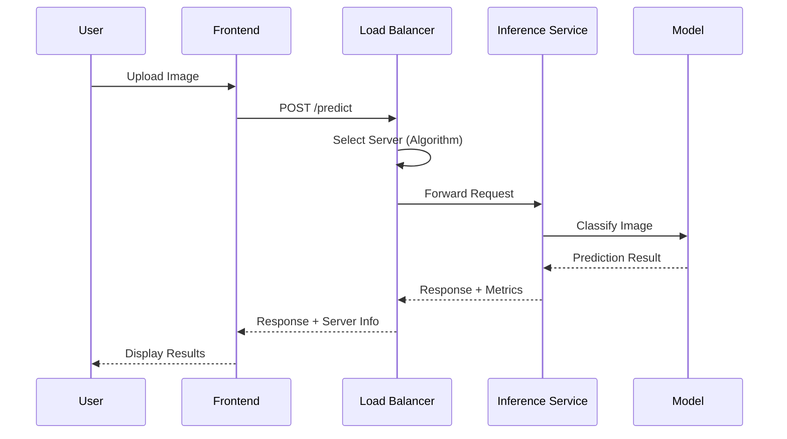
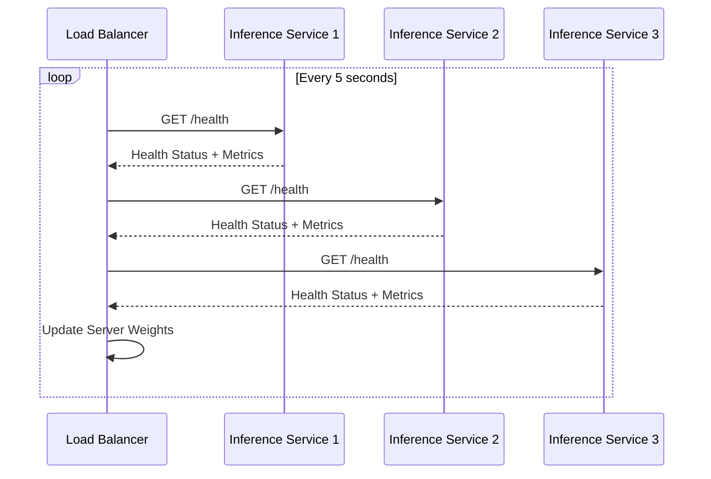

# System Architecture

## Overview

The AI Image Classification Service with SDN-based Load Balancing is designed as a microservices architecture that demonstrates modern cloud-native patterns while implementing intelligent network traffic management.

## System Components

```
┌─────────────────────────────────────────────────────────────────┐
│                        Web Frontend                             │
│                     (Static HTML/JS)                           │
└─────────────────────┬───────────────────────────────────────────┘
                      │ HTTP Requests
┌─────────────────────▼───────────────────────────────────────────┐
│                   Load Balancer                               │
│                  (Ryu SDN Controller)                         │
│  ┌─────────────┬─────────────┬─────────────┬─────────────┐    │
│  │Round Robin  │Least Conn   │Latency Weight│Weighted RR  │    │
│  └─────────────┴─────────────┴─────────────┴─────────────┘    │
└─────────┬─────────────┬─────────────┬─────────────────────────┘
          │             │             │
┌─────────▼───┐ ┌───────▼───┐ ┌───────▼───┐
│ Inference   │ │ Inference │ │ Inference │
│ Service 1   │ │ Service 2 │ │ Service 3 │
│ (Model v1)  │ │ (Model v1)│ │ (Model v2)│
└─────────────┘ └───────────┘ └───────────┘
          │             │             │
          └─────────────┼─────────────┘
                        │
                ┌───────▼───────┐
                │ Observability │
                │   Stack       │
                │ Prometheus    │
                │ Grafana       │
                └───────────────┘
```

## Request Flow

### 1. Image Upload Request


### 2. Health Monitoring


## Core Design Patterns

### 1. Circuit Breaker Pattern
- Health checks prevent routing to unhealthy servers
- Graceful degradation with fallback classifier
- Automatic recovery when services restore

### 2. Load Balancer Pattern
- Multiple algorithmic approaches
- Real-time server metrics consideration
- Dynamic weight adjustment

### 3. Observer Pattern
- Prometheus metrics collection
- Real-time statistics updates
- Health status propagation

### 4. Factory Pattern
- Model loader with fallback mechanisms
- Algorithm selection strategy
- Service initialization

## Technology Stack

### Frontend
- **Static HTML/JS**: Maximum compatibility, no build dependencies
- **CSS3**: Responsive design with dark/light themes
- **Fetch API**: RESTful communication with backend
- **Progressive Enhancement**: Graceful degradation

### Backend Services
- **Flask**: Lightweight web framework for API services
- **TensorFlow**: Machine learning model inference
- **Pillow**: Image processing and manipulation
- **Prometheus Client**: Metrics collection and export

### SDN Controller
- **Ryu**: OpenFlow-based SDN controller framework
- **Flask**: Management API for statistics and control
- **Threading**: Background health monitoring
- **Requests**: HTTP client for health checks

### Infrastructure
- **Docker**: Containerization and isolation
- **Docker Compose**: Multi-container orchestration
- **Prometheus**: Metrics collection and storage
- **Grafana**: Visualization and dashboards
- **Redis**: Optional caching layer

## Scalability Considerations

### Horizontal Scaling
- Stateless inference services
- Load balancer algorithm adaptation
- Container orchestration ready

### Vertical Scaling
- Model optimization opportunities
- Resource allocation tuning
- Performance monitoring

### Network Scaling
- SDN flow programming
- Traffic engineering capabilities
- Multi-path load distribution

## Security Architecture

### Container Security
- Non-root user execution
- Minimal base images
- Dependency scanning

### Network Security
- Isolated container networks
- No external dependencies for core functionality
- Health check authentication ready

### Data Security
- No persistent image storage
- In-memory processing only
- Metric data isolation

## Reliability Features

### Fault Tolerance
- Multiple inference service instances
- Automatic failover mechanisms
- Health check recovery

### Graceful Degradation
- Stub classifier fallback
- CPU-only operation capability
- Progressive error handling

### Monitoring & Alerting
- Comprehensive metrics collection
- Real-time health status
- Performance trend analysis

## Performance Characteristics

### Latency Targets
- API Response: < 2 seconds average
- Model Inference: < 1 second typical
- Health Checks: < 500ms
- UI Updates: < 100ms

### Throughput Expectations
- 10-50 requests/second (hardware dependent)
- Linear scaling with additional instances
- Network bandwidth optimization

### Resource Utilization
- Memory: ~2GB per inference service
- CPU: Varies with model complexity
- Disk: Minimal (models loaded in memory)

## Extension Points

### Model Integration
- Plugin architecture for new models
- Version management system
- A/B testing framework

### Load Balancing Algorithms
- Custom algorithm implementation
- Machine learning-based optimization
- Policy-driven routing

### Observability Enhancement
- Custom metrics definition
- Alerting rule configuration
- Dashboard customization

This architecture provides a solid foundation for demonstrating cloud-native principles, SDN capabilities, and machine learning operations in a production-like environment.