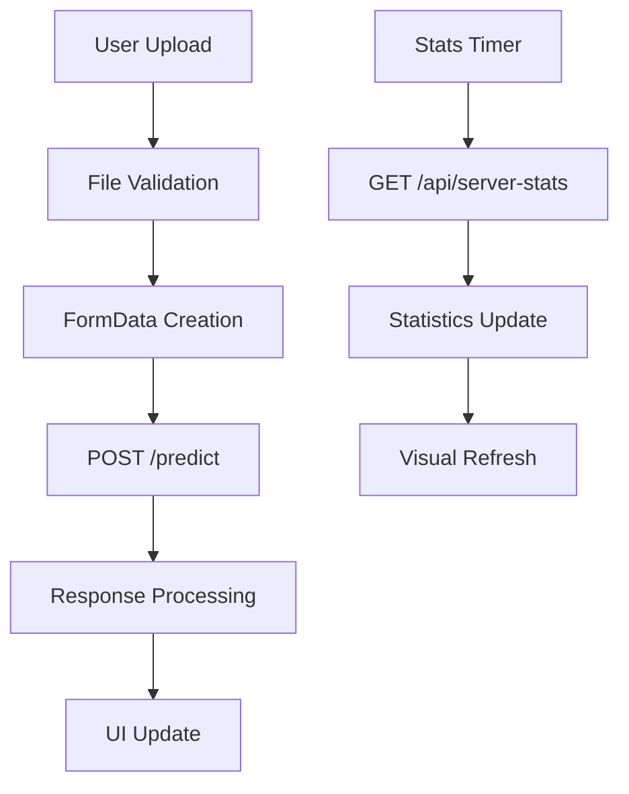

# Frontend Architecture and UI Notes

## Overview

The frontend provides a user-friendly web interface for the AI Image Classification Service, featuring real-time server statistics, drag & drop image upload, and comprehensive result display.

## Architecture Design

### Static First Approach
- **Primary Implementation**: Static HTML/JS/CSS (no build dependencies)
- **Fallback Strategy**: Always functional even if advanced features fail
- **Progressive Enhancement**: Enhanced features layer on top of basic functionality

### Technology Stack
- **HTML5**: Semantic markup with accessibility features
- **CSS3**: Modern styling with CSS Grid, Flexbox, and CSS Variables
- **Vanilla JavaScript**: ES6+ features with Fetch API for HTTP requests
- **No Dependencies**: Zero external JavaScript libraries for maximum compatibility

## Component Architecture

### 1. Application State Management
```javascript
// Global state (minimal and focused)
let currentImageFile = null;
let lastResult = null;
let statsInterval = null;
```

### 2. Configuration Management
```javascript
const CONFIG = {
    API_BASE_URL: 'http://localhost:5000',
    LB_API_URL: 'http://localhost:8080',
    STATS_REFRESH_INTERVAL: 3000,
    SAMPLE_IMAGES: { /* embedded test images */ }
};
```

### 3. Event-Driven Architecture
- File upload handling (drag & drop + traditional)
- Real-time statistics updates
- Theme management (dark/light mode)
- Error handling and user feedback

## Key Features Implementation

### 1. Image Upload System

**Drag & Drop Interface**:
- Visual feedback with hover states
- File validation (type, size)
- Real-time preview generation
- Accessibility with ARIA labels

**File Processing Pipeline**:
```
User Input → Validation → Preview → Classification → Results Display
```

### 2. Results Display

**Information Architecture**:
- Primary: Classification label and confidence
- Secondary: Server metadata (ID, model version, latency)
- Tertiary: Actions (repeat, copy JSON)

**Visual Design**:
- Color-coded confidence bars
- Progressive disclosure of technical details
- Copy-to-clipboard functionality for debugging

### 3. Server Statistics Dashboard

**Real-time Updates**:
- 3-second refresh interval
- Graceful degradation if API unavailable
- Visual distribution bars showing load balancing

**Data Visualization**:
- ASCII-style progress bars (no external dependencies)
- Health status indicators (green/red dots)
- Request count distribution across servers

### 4. Theme System

**CSS Variables Approach**:
```css
:root {
    --bg-primary: #ffffff;
    --text-primary: #1a202c;
    /* ... */
}

[data-theme="dark"] {
    --bg-primary: #1a202c;
    --text-primary: #f7fafc;
    /* ... */
}
```

**Benefits**:
- Instant theme switching
- Consistent color scheme
- Easy customization
- No JavaScript color calculations

## API Integration

### 1. Endpoint Consumption

**Primary Endpoints**:
- `POST /predict` - Image classification
- `GET /health` - Service health status
- `GET /api/server-stats` - Load balancer statistics

**Error Handling Strategy**:
- Network timeout handling
- Graceful degradation for unavailable services
- User-friendly error messages
- Automatic retry for transient failures

### 2. Data Flow



### 3. Request/Response Handling

**Request Format**:
```javascript
const formData = new FormData();
formData.append('image', imageFile);

fetch('/predict', {
    method: 'POST',
    body: formData
})
```

**Response Processing**:
```javascript
const result = await response.json();
if (result.error) {
    showError(result.error);
} else {
    displayResult(result);
}
```

## Responsive Design Strategy

### 1. Mobile-First Approach
- Base styles for mobile devices
- Progressive enhancement for larger screens
- Touch-friendly interface elements

### 2. Breakpoint Strategy
```css
/* Mobile: default styles */
/* Tablet: 768px+ */
@media (max-width: 768px) { /* ... */ }
/* Desktop: 1024px+ */
@media (max-width: 480px) { /* ... */ }
```

### 3. Grid System
- CSS Grid for complex layouts
- Flexbox for component-level alignment
- Responsive image handling

## Accessibility Features

### 1. Semantic HTML
- Proper heading hierarchy (h1-h6)
- Meaningful link text
- Form labels and fieldsets
- ARIA landmarks

### 2. Keyboard Navigation
- Tab order management
- Focus indicators
- Keyboard shortcuts for common actions

### 3. Screen Reader Support
- Alt text for images
- ARIA labels for complex interactions
- Status announcements for dynamic content

### 4. Color and Contrast
- WCAG 2.1 AA compliance
- High contrast mode support
- Color-blind friendly palette

## Performance Optimizations

### 1. Resource Loading
- Minimal external dependencies
- Optimized image formats
- Lazy loading for non-critical features

### 2. Network Efficiency
- Request debouncing
- Efficient polling strategies
- Connection reuse

### 3. Memory Management
- Event listener cleanup
- Image object disposal
- Interval management

## Error Handling Philosophy

### 1. Graceful Degradation
- Core functionality always available
- Progressive feature enhancement
- Fallback for network failures

### 2. User Experience Focus
- Clear error messages
- Recovery suggestions
- Non-blocking error notifications

### 3. Developer Experience
- Console logging for debugging
- JSON copy functionality
- Network request inspection

## Extension Points

### 1. Component System
Ready for conversion to modern frameworks:
- React components
- Vue.js integration
- Angular modules

### 2. State Management
Prepared for advanced state solutions:
- Redux integration points
- RxJS observables
- MobX stores

### 3. Build System Integration
Compatible with modern tooling:
- Webpack bundling
- Vite development
- Parcel building

## Testing Strategy

### 1. Manual Testing Checklist
- [ ] Image upload (drag & drop)
- [ ] Image upload (file browser)
- [ ] Classification results display
- [ ] Server statistics updates
- [ ] Theme switching
- [ ] Error handling
- [ ] Mobile responsiveness

### 2. Automated Testing Opportunities
- Unit tests for utility functions
- Integration tests for API calls
- E2E tests for user workflows
- Visual regression testing

### 3. Performance Testing
- Lighthouse audits
- Core Web Vitals monitoring
- Load testing with multiple users

## Deployment Considerations

### 1. Static Hosting
- Compatible with any web server
- CDN-friendly architecture
- No server-side requirements

### 2. Container Integration
- Nginx serving static files
- Docker multi-stage builds
- Health check endpoints

### 3. Configuration Management
- Environment-specific API URLs
- Feature flag support
- Runtime configuration

This frontend architecture demonstrates modern web development practices while maintaining simplicity and reliability for educational and production use.